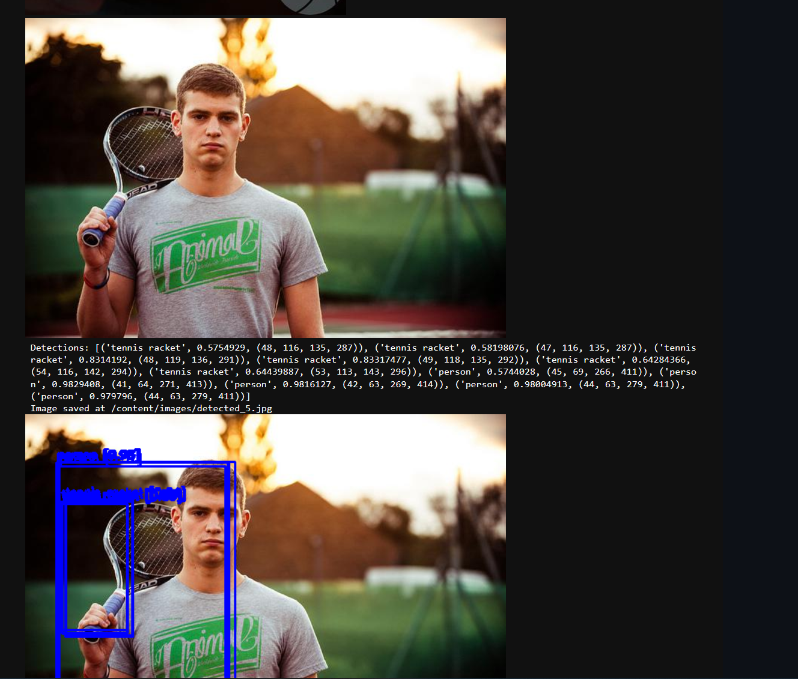
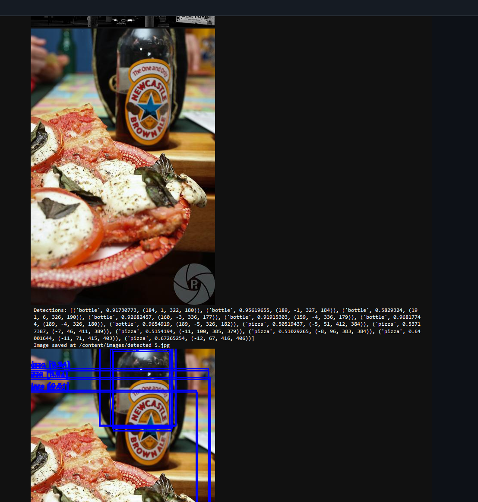

# Projet IOT : Détection d'objets en temps réel avec YOLOv4

## Aperçu du projet

Ce projet illustre la mise en œuvre de la détection d'objets en utilisant le modèle YOLOv4. Le code utilise OpenCV, NumPy, et d'autres bibliothèques pertinentes pour accomplir la détection d'objets.
Pour lINstant, le code recupere une liste d'images depuis le web et les traite pour détecter des objets.
Les résultats de détection sont initialement affichés dans la console pour des tests et développements ultérieurs, ils pourront être envoyés à un broker MQTT et stockés dans une base de données.

Le code source est disponible dans mon dépôt GitHub [ProjetIOT](https://github.com/youssefchlendi/ProjetIOT)

## Étapes à suivre

### 1. Importation des bibliothèques

Les bibliothèques nécessaires pour le projet incluent OpenCV pour le traitement d'images, NumPy pour la manipulation des données, et PIL pour la gestion des images. Matplotlib est utilisé pour l'affichage des images dans un environnement de notebook.

```python
!pip install paho-mqtt
!pip install pymongo

from IPython.display import display, Javascript, Image
from google.colab.patches import cv2_imshow
from base64 import b64decode, b64encode
import cv2
import numpy as np
import PIL
import io
import html
import time
import matplotlib.pyplot as plt
%matplotlib inline
```

### 2. Clonage et préparation du modèle YOLOv4

Le modèle YOLOv4 est cloné depuis le dépôt officiel et préparé avec les configurations nécessaires pour l'utilisation du GPU et d'OpenCV.

```python
!git clone https://github.com/AlexeyAB/darknet
%cd darknet
!sed -i 's/OPENCV=0/OPENCV=1/' Makefile
!make
```

### 3. Téléchargement et chargement des poids du modèle

Les poids pré-entraînés de YOLOv4 sont téléchargés et chargés dans le modèle configuré.

```python
!wget https://pjreddie.com/media/files/yolov4.weights
```

### 4. Détection d'objets sur des images aléatoires

Les images sont récupérées aléatoirement du web et traitées pour détecter des objets. Chaque image traitée est ensuite affichée avec les boîtes de délimitation et les étiquettes des objets détectés.

```python
images = [
    "https://example.com/image1.jpg",
    "https://example.com/image2.jpg",
    # Plus d'URLs d'images
]

for image_url in images:
    frame = get_image(image_url)
    detections = darknet_helper(frame, 416, 416)
    # Dessin des boîtes de délimitation et affichage des résultats
    display_image_with_boxes(frame, detections)
    cv2.imwrite('/content/detected_images/detected_image.jpg', frame)
```

## Validation de la détection




Vous pouvez trouver le code complet dans le fichier `main.ipynb`.
**Emplacement du dépôt**: [Lien](https://github.com/youssefchlendi/ProjetIOT/blob/main/main.ipynb)
